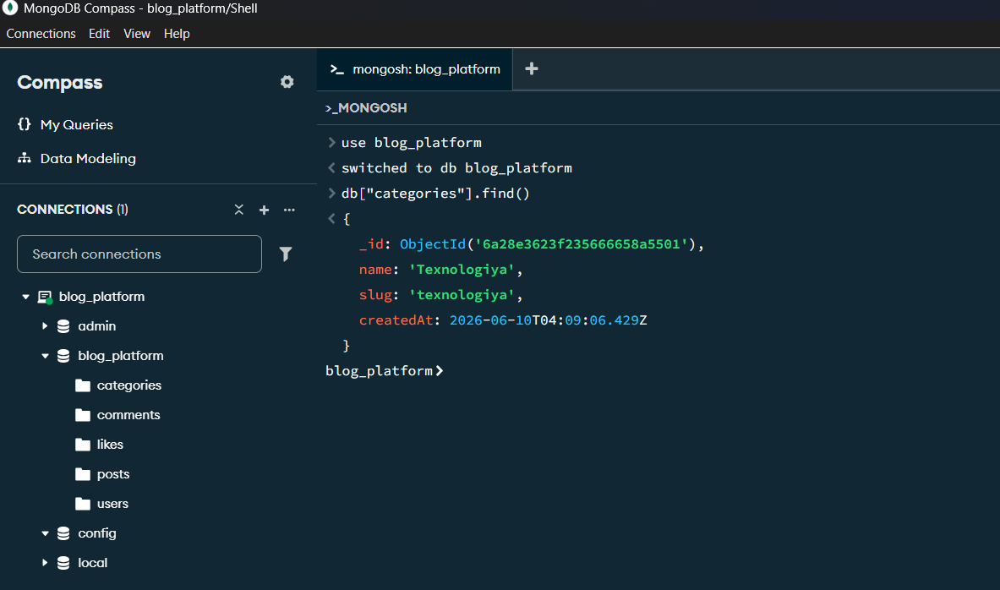
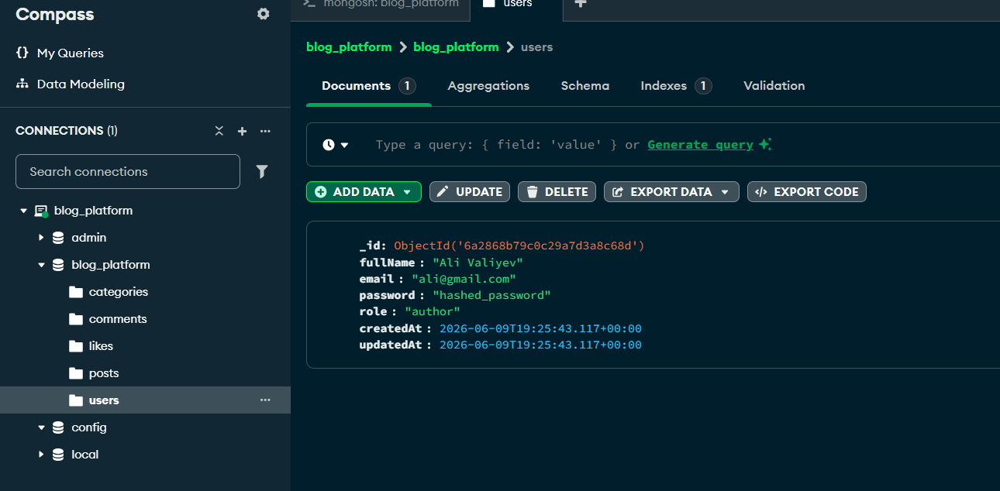
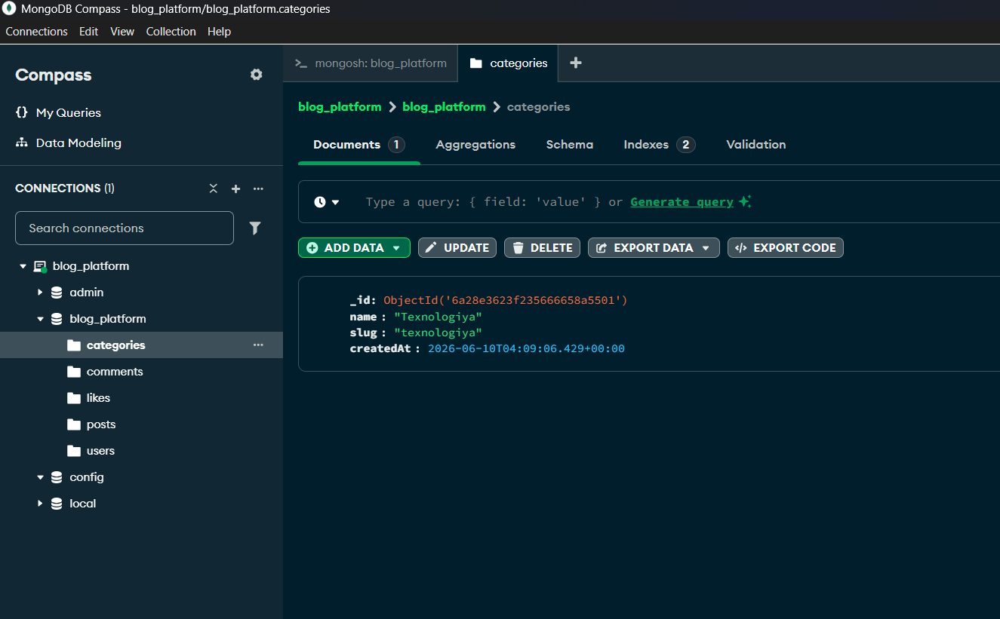
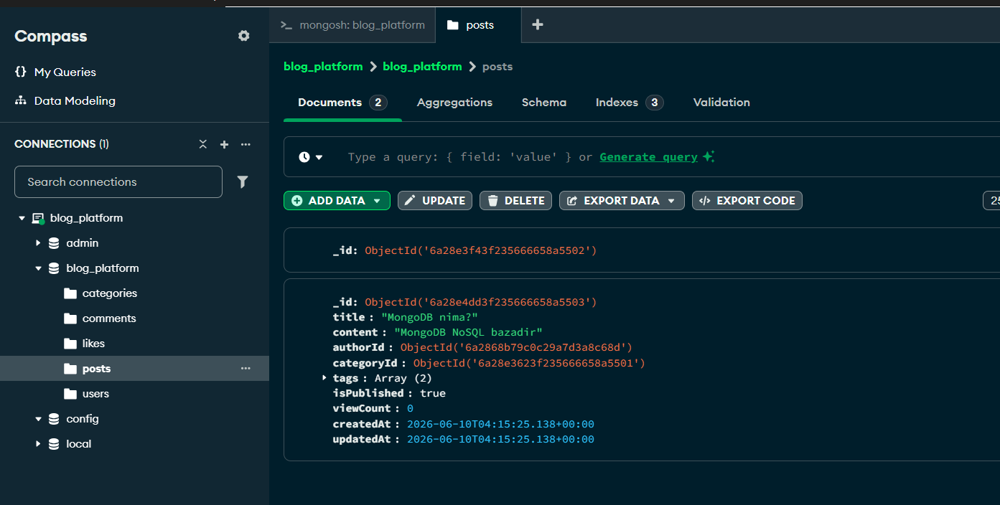
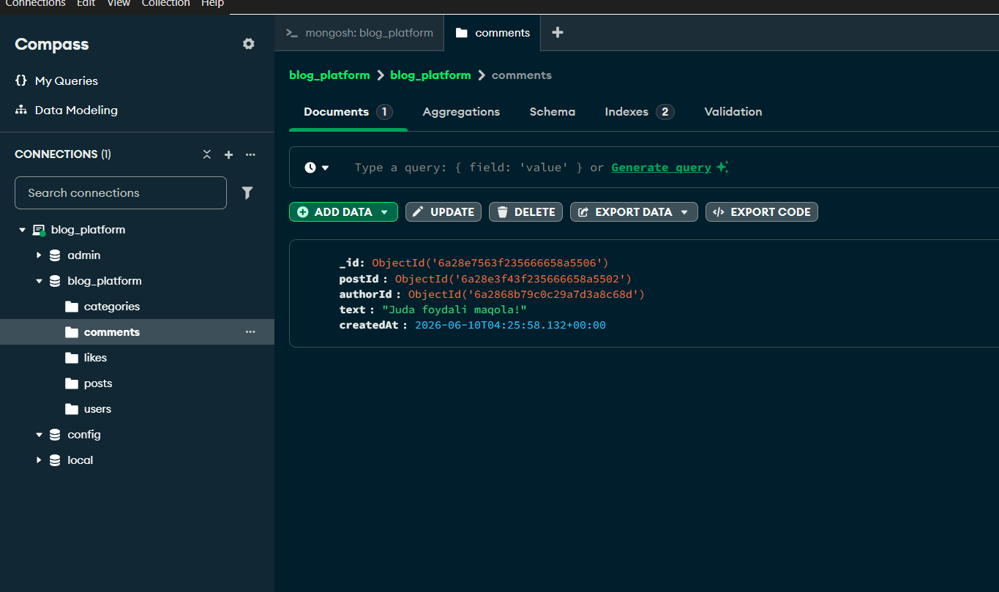
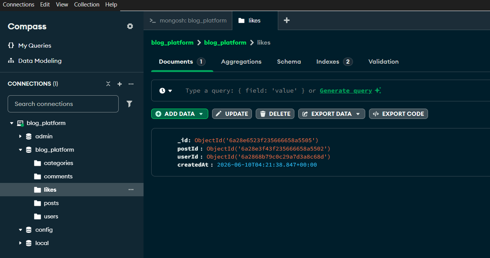

# Week 5 Uy Vazifasi — Simple Blog Platform

## MongoDB Collections



---

## 1. users Collection

**Nima saqlaydi:** Foydalanuvchilar (maqola yozuvchilar va o'quvchilar)

**Fields:**
```js
{
  _id: ObjectId,
  fullName: String,
  email: String,
  password: String,
  role: "author" | "reader" | "admin",
  createdAt: Date,
  updatedAt: Date
}
```

**ObjectId references:** Yo'q (boshqa collectionlar shu ga reference qiladi)

**Indexes:**
```js
db.users.createIndex({ email: 1 }, { unique: true })
```

**Embedded:** Hech narsa embed qilinmaydi

**Referenced:** `posts`, `comments`, `likes` collectionlari `userId` orqali shu ga bog'lanadi



---

## 2. categories Collection

**Nima saqlaydi:** Maqola kategoriyalari

**Fields:**
```js
{
  _id: ObjectId,
  name: String,
  slug: String,
  createdAt: Date
}
```

**ObjectId references:** Yo'q

**Indexes:**
```js
db.categories.createIndex({ slug: 1 }, { unique: true })
```

**Embedded:** Hech narsa

**Referenced:** `posts` collection `categoryId` orqali shu ga bog'lanadi



---

## 3. posts Collection

**Nima saqlaydi:** Blog maqolalari

**Fields:**
```js
{
  _id: ObjectId,
  title: String,
  content: String,
  authorId: ObjectId,    // → users
  categoryId: ObjectId,  // → categories
  tags: Array,
  isPublished: Boolean,
  viewCount: Number,
  createdAt: Date,
  updatedAt: Date
}
```

**ObjectId references:**
- `authorId` → users
- `categoryId` → categories

**Indexes:**
```js
db.posts.createIndex({ authorId: 1 })
db.posts.createIndex({ categoryId: 1 })
```

**Embedded:** `tags` massivi — kichik va faqat shu postga tegishli

**Referenced:** `authorId`, `categoryId` — boshqa collectionlarda ham ishlatiladi



---

## 4. comments Collection

**Nima saqlaydi:** Postlarga yozilgan izohlar

**Fields:**
```js
{
  _id: ObjectId,
  postId: ObjectId,    // → posts
  authorId: ObjectId,  // → users
  text: String,
  createdAt: Date
}
```

**ObjectId references:**
- `postId` → posts
- `authorId` → users

**Indexes:**
```js
db.comments.createIndex({ postId: 1 })
```

**Embedded:** Hech narsa

**Referenced:** Hamma narsa referenced — comments alohida collection da saqlanadi



---

## 5. likes Collection

**Nima saqlaydi:** Kim qaysi postga like bosgan

**Fields:**
```js
{
  _id: ObjectId,
  postId: ObjectId,  // → posts
  userId: ObjectId,  // → users
  createdAt: Date
}
```

**ObjectId references:**
- `postId` → posts
- `userId` → users

**Indexes:**
```js
db.likes.createIndex({ postId: 1, userId: 1 }, { unique: true })
// Bir user bir postga faqat 1 marta like bosa oladi
```

**Embedded:** Hech narsa

**Referenced:** Hamma narsa referenced

