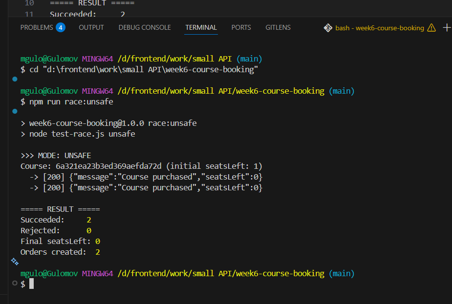
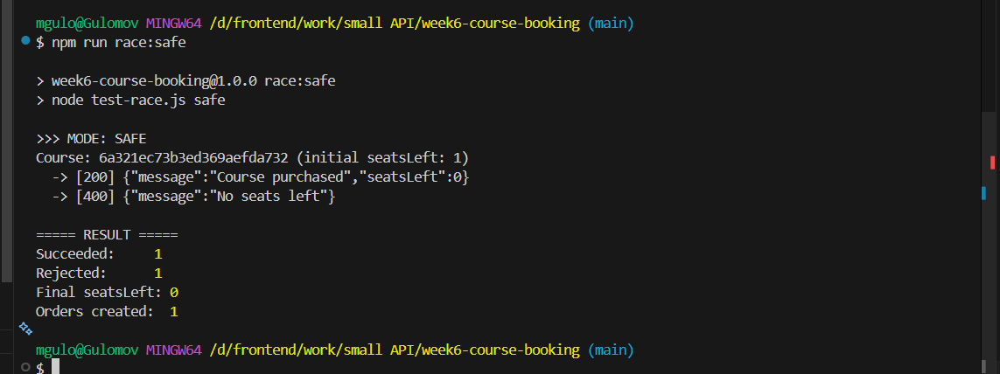
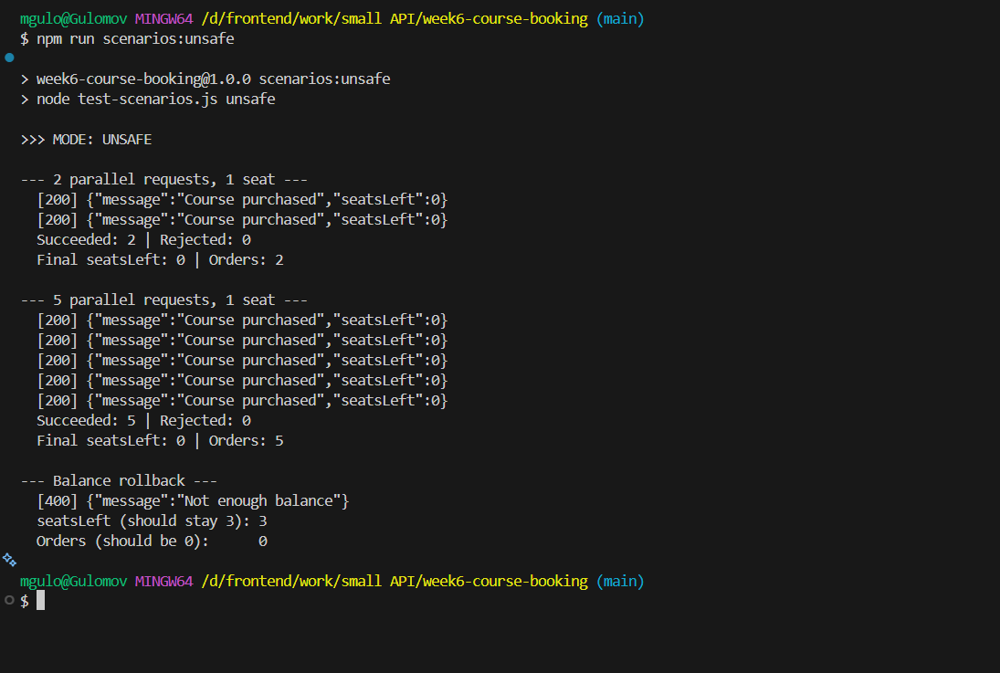
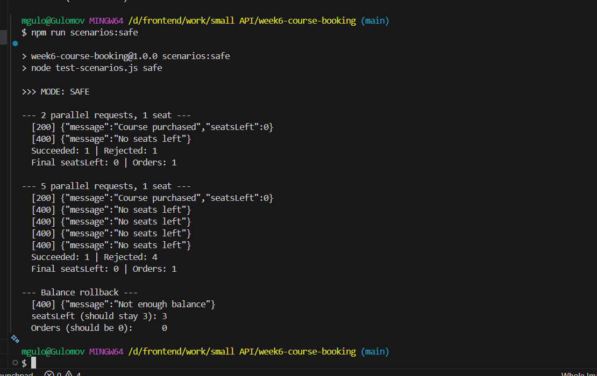

# Week 6 — Course Booking API (Transactions & Race Conditions)

A small Node.js + Express + MongoDB (Mongoose) API for buying limited-seat
courses. The goal is to prevent **overbooking** — two people buying the same
last seat.

## Run

```bash
# MongoDB with a replica set (transactions require it)
docker run -d --name mongo-week6 -p 27017:27017 mongo:7 --replSet rs0
docker exec mongo-week6 mongosh --quiet --eval 'rs.initiate({_id:"rs0",members:[{_id:0,host:"localhost:27017"}]})'

npm install
npm run dev        # http://localhost:3000
```

The buy endpoint accepts `?mode=unsafe|safe`, so both versions can be tested
against the same server:

```bash
npm run race:unsafe   |  npm run race:safe
npm run scenarios:unsafe   |  npm run scenarios:safe
```

## What was wrong

The unsafe version did **read → check → write**. Two requests read
`seatsLeft = 1` at the same time, both passed the check, and both bought the
seat → overbooking.

## How it was fixed

1. **Atomic conditional update** — `updateOne({ _id, seatsLeft: { $gt: 0 } }, { $inc: { seatsLeft: -1 } })`.
   Check and update happen in one operation, so only one request can win the seat.
2. **Transaction** — if a later step (balance) fails, everything rolls back, so
   no order is ever created without payment.

## Screenshots

### 1. Unsafe — 2 parallel requests, 1 seat
Both requests succeed → **2 orders for 1 seat** (the bug).



### 2. Safe — 2 parallel requests, 1 seat
One succeeds, the other gets `No seats left` → **1 order**.



### 3. Unsafe — 5 parallel requests, 1 seat
All 5 succeed → **5 orders for 1 seat**.



### 4. Safe — 5 parallel requests + balance rollback
Only 1 succeeds → **1 order**; insufficient balance rolls back (seats stay, no order).


